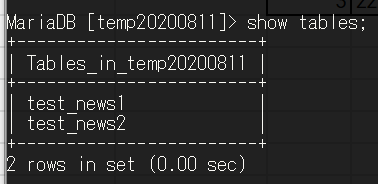
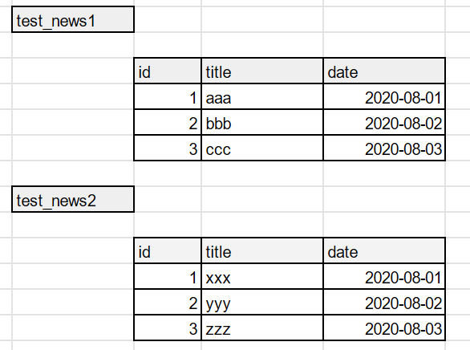
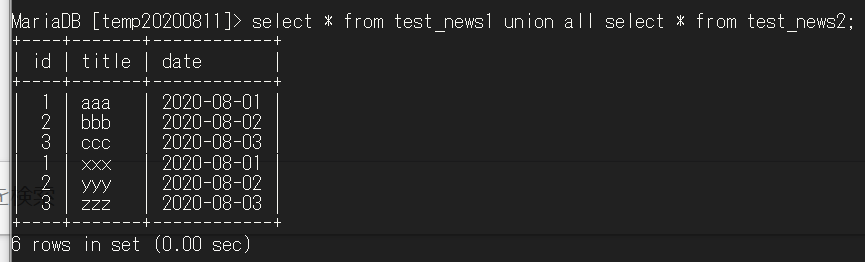
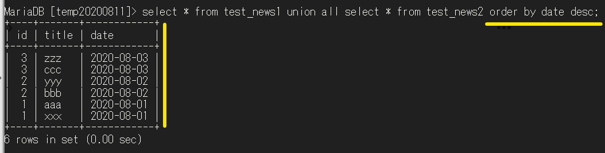

# テーブルを縦につなげる（UNION ALL）

LIKEを用いて、複数のテーブルから


## 1 【準備】データベース内に２つテーブル



```SQL
SHOW TABLES;
```

## 2 テーブルの中身




## 3 縦につなげる


```SQL
SELECT * FROM test_news1
UNION ALL
SELECT * FROM test_news2;
```

※カラムが一致しないといけない


## 4 日付（dateカラム）で並び替える


```SQL
SELECT * FROM test_news1
UNION ALL
SELECT * FROM test_news2
ORDER BY date DESC;
-- ORDER BY // ソート
-- DESC // 降順
```
